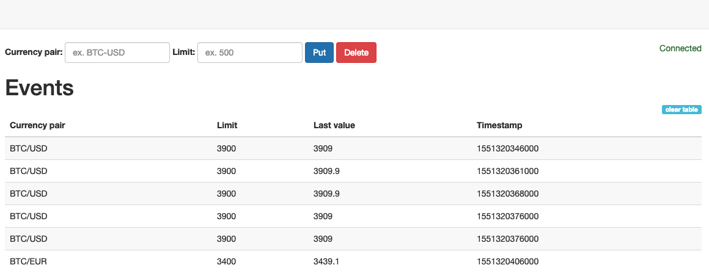

### Description
Spring Boot application to notify when currency's price has changed above some limit

### Components/Modules
 * Server - server REST and WebSocket endpoints
    * SwaggerUI: http://localhost:8888/swagger-ui.html
 * Client - client console ans WEB component
    * WEB: http://localhost:8889
    
    
 * Integration - integration test between client and server
 
### How to start
 * Server - run ```ServerApplication```
 * Client - run ```ClientApplication```
 * Tests - ```mvn clean test```
 
### Assumptions
 * Market data provider - Bitfinex (BitfinexMarketTickerProvider - info.bitrich.xchangestream.bitfinex.BitfinexStreamingExchange)
 * Client does not receive any alerts without any limit
 * Only one limit per currency pair
 * Console client only show alerts that price has changed above some limit
 * Set and Remove limits from Web UI or SwaggerUI
